# Beginner’s Minecraft Manual – Key Visuals and Sections

## Table of Contents

- [1. "Create New World" Screen (Game Mode & Difficulty)](#1-create-new-world-screen-game-mode-difficulty)
- [2. Punching a Tree for Wood](#2-punching-a-tree-for-wood)
- [3. Crafting Table & Basic Tool Crafting](#3-crafting-table-basic-tool-crafting)
- [4. First-Night Shelters (Dirt Hut and Cave)](#4-first-night-shelters-dirt-hut-and-cave)
- [5. Hostile Mobs at Night (Zombie, Creeper, Skeleton, Spider)](#5-hostile-mobs-at-night-zombie-creeper-skeleton-spider)
- [6. Coal and Iron Ore in a Cave](#6-coal-and-iron-ore-in-a-cave)
- [7. Crafting Iron Tools and Armor](#7-crafting-iron-tools-and-armor)
- [8. How To find diamonds](#8-How-to-find-diamonds)
- [9. Small Wheat Farm by Water](#9-small-wheat-farm-by-water)
- [10. Exploring the Nether](#10-exploring-the-nether)
- [11. Using a Map or Coordinates](#11-using-a-map-or-coordinates)
- [12. Throwing an Eye of Ender to Find a Stronghold](#12-throwing-an-eye-of-ender-to-find-a-stronghold)
- [13. The Ender Dragon Battle (The End)](#13-the-ender-dragon-battle-the-end)
- [14. Creative Mode Inventory (Unlimited Blocks)](#14-creative-mode-inventory-unlimited-blocks)
- [15. AI Use and Conclusions](#15-ai-use-and-conclusions)

## 1. "Create New World" Screen (Game Mode & Difficulty)

In this menu you create your new Minecraft world. You can pick your preferred game mode, insert a seed (optional), and select the difficulty level.

To set up your world:

- **Choose a game mode**: Survival or Creative (Hardcore is also available in Java Edition).
- **Set the difficulty**: Peaceful, Easy, Normal, or Hard.
- **Optional settings**: Add a seed, toggle Allow Cheats or enable Experiments.
- Once you're happy with the settings, click **Create New World** to begin.

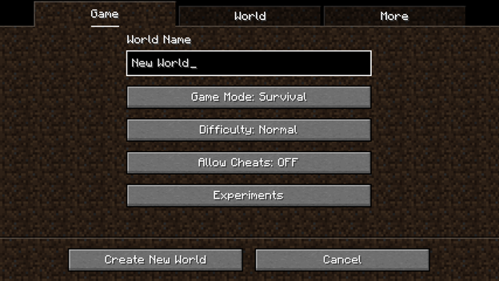

## 2. Punching a Tree for Wood
Punching trees is how every Minecraft game starts. Wood is essential for crafting and building your first shelter.

To collect wood:

- Walk up to a tree and hold down the attack button to punch the log.
- Pick up the dropped **wooden logs**.
- Use logs to craft **wooden planks**, **sticks**, and a **crafting table**.
- These resources will allow you to make tools, weapons, and your first house.

## 3. Crafting Table & Basic Tool Crafting
Once you have wood, you can start crafting the tools you'll need to survive.

Steps to get started:

- Craft **wooden planks** from logs in your 2x2 inventory grid.
- Use 4 planks to make a **Crafting Table**.
- Place the table and right-click to access the **3×3 crafting grid**.
- To craft a wooden pickaxe:  
  - Place 3 wooden planks across the top row,  
  - Place 2 sticks vertically in the middle column.

This setup gives you a basic pickaxe to collect stone and coal.

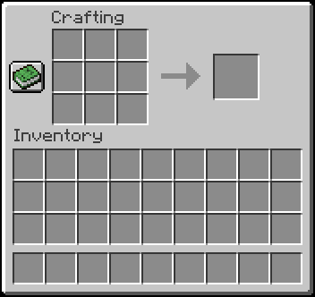

How to Craft a Sword                                                   

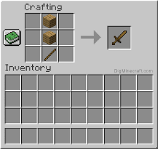                                 

How to Craft a Pickaxe

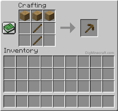

How to Craft A Shovel

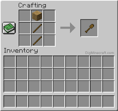

How to craft a axe

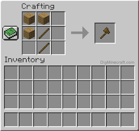

## 4. First-Night Shelters (Dirt Hut and Cave)

Your first shelter is super important to surviving the first night. Without protection, mobs like zombies and skeletons will attack you at night.

Ways to create your first shelter:

- **Dirt hut**: Use dirt blocks to quickly build a structure which will keep yous safe from the mobs.
- **Add a door and a torch**: Makes it safer and easier to see inside.
- **Cave shelter**: Dig into the side of a hill or mountain to make a “hobbit hole.”
- **Block the entrance**: Use a door or blocks so mobs can’t get in.
- **Light it up**: Place torches inside to prevent mob spawns.

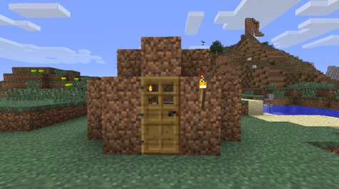

In fact, you can create a base on a hillside where you're protected by the walls around you so no mobs can spawn there.
By hollowing out a little cave and blocking the entrance, you get a safe “hobbit hole.” Whichever style you choose, ensure you have light (torches) and a 1-block opening (with door or blocks) that monsters cannot get through overnight.

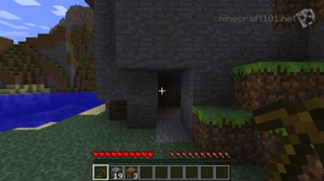

## 5. Hostile Mobs at Night (Zombie, Creeper, Skeleton, Spider)

When the sun goes down and it turns night time mobs will start to appear and threaten you.

Mob types and behavior:

- **Zombies**: Slowly walk toward you and attack in groups.
- **Creepers**: Sneak up silently and explode when you get close to them.
- **Skeletons**: Shoot arrows from a distance.
- **Spiders**: Jump and climb walls.

> 💡 Tip: Keep your shelter lit and craft a sword early to defend yourself.

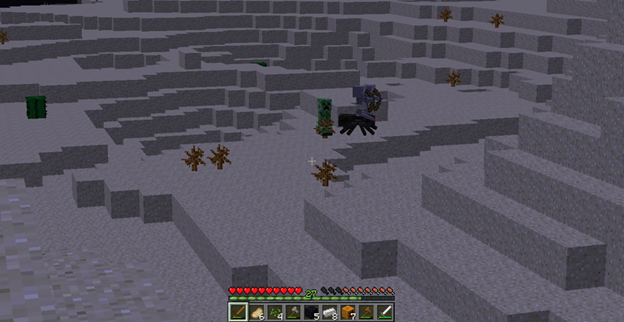

You should also watchout for creepers as if you get to close to them they can blow up, dealing lots of damage to you and blowing up the surrounding areas around you and potentially damaging your house or even killing you

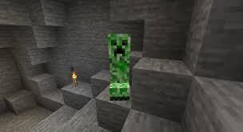

## 6. Coal and Iron Ore in a Cave
Coal and iron ore are super important to the beggining of the game since its easy to find and provides useful resources for you to advance further into the game

Where to look and what to do:

- **Coal ore**: Black-speckled stone found in surface-level caves.
- **Iron ore**: Beige-speckled stone found a bit deeper underground.
- **Use a stone pickaxe**: Needed to mine iron.
- **Smelt iron**: Use a furnace to turn raw iron into iron ingots.
- **Use coal**: For torches and as fuel in furnaces.

 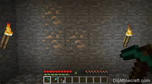 
 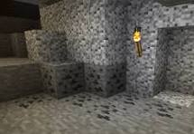

## 7. Crafting Iron Tools and Armor
Iron tools and armor offer better durability and protection than wood or stone.

To craft iron gear:

- **Smelt iron ore** in a furnace to get iron ingots.
- **Use the crafting table** to make tools: pickaxe, sword, axe, etc.
- **Craft armor**: 24 ingots total makes a full set (helmet, chestplate, leggings, boots).
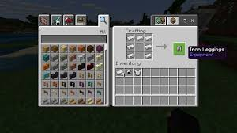

In order to get iron ingots you have to smelt it in a furnace

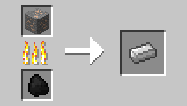

How to Craft a Furnace

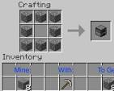

## 8. How to find diamonds
Diamonds are one of the most valuable resources in Minecraft. They’re used to craft powerful gear like diamond tools, armor, and the enchantment table.

To find diamonds, follow these tips:

- **Mine at the right level**: In Minecraft 1.18 and later, the best Y-level to find diamonds is **Y = -58**. Press `F3` (Java) or enable coordinates (Bedrock) to find your Y-level.
- **Use strip mining or branch mining**: Dig a main tunnel and then branch off sideways every few blocks.
- **Bring the right tools**: Use at least an iron pickaxe to mine diamonds.
- **Use Fortune enchantment**: If you have a Fortune-enchanted pickaxe, you’ll get more diamonds from each block.

> 💡 Tip: Lava is common at deep levels, so carry a water bucket!

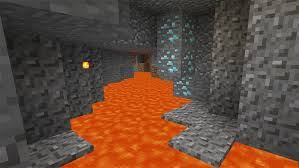

## 9. Small Wheat Farm by Water
Farming provides food and is essential for long-term survival in Minecraft.

To start a wheat farm:

- **Pick a flat area near water**, or bring a water bucket to your farm spot.
- **Use a hoe** on grass blocks to turn them into farmland.
- **Plant seeds** (you get them by breaking tall grass).
- **Hydration**: Farmland within 4 blocks of water will stay hydrated (it looks darker), which helps crops grow faster.
- **Beginner farm tip**: A classic starter design is a 9×9 square of farmland with water in the center.
- **Light the area** with torches so crops grow even at night.
- After some time, wheat turns golden and can be harvested for crafting bread and other food.
- You can often find wheat farms already growing in villages.

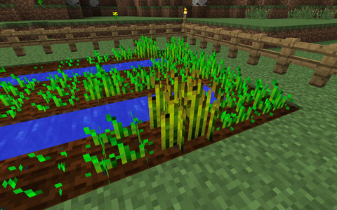

How to craft bread out of wheat

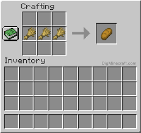

## 10. Exploring the Nether

The Nether is a dangerous, its a hell like dimension filled with lava, hostile mobs, and rare resources. It’s essential for progressing in the game, especially for crafting potions and reaching the End.

### 🔧 How to Enter the Nether:
1. Build a Nether Portal using obsidian blocks in a rectangular frame (minimum 4×5 size, max 23×23).
2. Light the portal with flint and steel.
3. Step into the portal and stand still, and it will transport you to the Nether.

   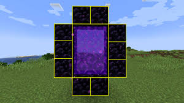

### 💎 What You’ll Find in the Nether:
- Nether Quartz – Used for redstone and decorative blocks.
- Glowstone – Emits strong light and can be used in potions and makes for a nice decoration block.
- Nether Fortresses – Contain Blaze spawners (when you kill blazes it will help you craft blaze bowder to craft the eye of ender) and loot chests.
- Bastions – Piglin structures filled with gold and danger.
- Ancient Debris – Smelted into Netherite scraps, used to upgrade diamond gear and craft nethorite amour and gear.

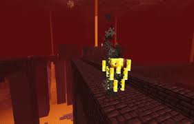

### ⚠️ Tips Before Entering:
- Wear gold armor so Piglins won’t attack you.
- Bring block, a bow, and plenty of food.
- Keep a flint and steel or fire charge in case your portal is disabled.
- Don't sleep in the Nether — beds explode!

## 11. Using a Map or Coordinates
Minecraft has a map item and a coordinate system to help you navigate.

Here's how it works:

- **Crafting a map**: Combine 9 paper and 1 compass to create a map. As you move, it draws the surrounding terrain.
- **Bedrock Edition**: The map’s top corner displays your coordinates automatically.
- **Java Edition**: Press `F3` to open the debug screen, which shows your current coordinates (X, Y, Z).
- **Using coordinates**: You can note down these coordinates to return to your base or important spots.
- **Pro tip**: Many players rely on coordinates instead of maps early on because it's faster and more precise for locating places.
 
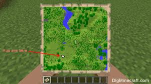

## 12. Throwing an Eye of Ender to Find a Stronghold
Crafting Eyes of Ender is essential for locating a Stronghold which is the structure that contains the End Portal.

Steps and tips:

- **Craft an Eye of Ender** by combining an Ender Pearl and Blaze Powder in your inventory.
- **Gear up** before searching Strongholds are often underground and can contain mobs.
- Eyes of Ender are used to find the nearest Stronghold by throwing them into the air.

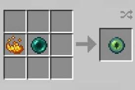

How it works:

- **Throw an Eye of Ender** (right-click while holding it) and it will float upward.
- It moves in the direction of the nearest Stronghold.
- **Follow it**, and if it doesn’t break, you can pick it up and throw it again.
- **Repeat the process** until you reach the location eventually it will hover above one spot then drop straight down, indicating the Stronghold is below.
- Be sure to **craft multiple Eyes**, as they have a chance to break when thrown.

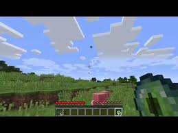

## 13. The Ender Dragon Battle (The End)
The final challenge in vanilla Minecraft is the Ender Dragon fight in The End dimension. To reach the End, activate the portal in a stronghold using 12 Eyes of Ender. The battle takes place on the End’s obsidian island with tall obsidian towers (each with End Crystals that heal the dragon).

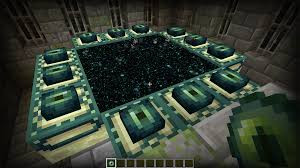

The dragon will fly around and attack – you must destroy the End Crystals and then reduce the
dragon’s health to zero.

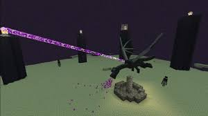

## 14. Creative Mode Inventory (Unlimited Blocks)
In Creative mode, the player has unlimited blocks and items and cannot die under normal conditions.

Key features of Creative mode:

- The inventory screen contains **every item in the game**, sorted into categories like Building Blocks, Tools, Combat, Redstone, and more.
- You can grab **any quantity** of any item instantly.
- You can **fly freely** and build without gravity or fall damage.
- **No need to gather resources** you can just place blocks instantly and destroy them in one hit.

How to access Creative mode:

- Start a world with the game mode set to **Creative**, or
- If cheats are enabled, type `/gamemode creative` in the chat.

> 💡 Perfect for massive builds, testing redstone circuits, or experimenting freely.
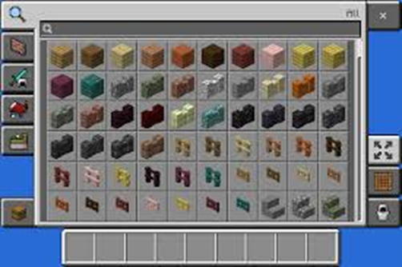
## 15. AI Use and Conclusions

This Minecraft beginner’s manual was created with the help of AI to assist in formatting, organizing, and clearly presenting game instructions in a readable and structured format.

Key points:

- The content was originally written in human voice and enhanced using AI for **organization, markdown formatting, and consistency**.
- All gameplay insights and strategies reflect typical Minecraft experiences as observed and described by real players.
- AI helped generate clean bullet lists, image callouts, and table of contents linking — making the guide easier to follow for beginners.

> 🤖 AI was used as a formatting and editorial assistant — not to replace human insight or gameplay knowledge.

Thank you for reading! Whether you're building your first shelter or facing the Ender Dragon, enjoy every block of your Minecraft journey. 🌍✨

