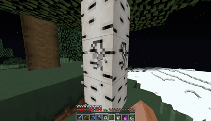

# Beginner’s Minecraft Manual – Key Visuals and Sections

## Table of Contents

- [1. "Create New World" Screen (Game Mode & Difficulty)](#1-create-new-world-screen-game-mode-difficulty)
- [2. Punching a Tree for Wood](#2-punching-a-tree-for-wood)
- [3. Crafting Table & Basic Tool Crafting](#3-crafting-table-basic-tool-crafting)
- [4. First-Night Shelters (Dirt Hut and Cave)](#4-first-night-shelters-dirt-hut-and-cave)
- [5. Hostile Mobs at Night (Zombie, Creeper, Skeleton, Spider)](#5-hostile-mobs-at-night-zombie-creeper-skeleton-spider)
- [6. Coal and Iron Ore in a Cave](#6-coal-and-iron-ore-in-a-cave)
- [7. Crafting Iron Tools and Armor](#7-crafting-iron-tools-and-armor)
- [8. How To find diamonds](#8-How-to-find-diamonds)
- [9. Small Wheat Farm by Water](#9-small-wheat-farm-by-water)
- [10. Exploring the Nether](#10-exploring-the-nether)
- [11. Using a Map or Coordinates](#11-using-a-map-or-coordinates)
- [12. Throwing an Eye of Ender to Find a Stronghold](#12-throwing-an-eye-of-ender-to-find-a-stronghold)
- [13. The Ender Dragon Battle (The End)](#13-the-ender-dragon-battle-the-end)
- [14. Creative Mode Inventory (Unlimited Blocks)](#14-creative-mode-inventory-unlimited-blocks)

## 1. "Create New World" Screen (Game Mode & Difficulty)
In this menu you create your new Minecraft world.

-Here you pick the game mode you want, insert a seed (optional), and select the difficulty.

-You can choose Survival or Creative mode (Hardcore is also available in Java Edition).

-Set the difficulty: Peaceful, Easy, Normal, or Hard for your new world.

-The screen also has options like Allow Cheats and experimental toggles.

-Once you’re happy with the settings, click Create New World to generate the world.

## 2. Punching a Tree for Wood
Punching Minecraft trees is essential to getting wood which is the building block and essential
to starting the game and building your bed and house with wood. And most importantly making
a crafting table. Wood is also the basic block to creating sticks which helps you make tools for
your swords and utility. Wood from logs is the first resource; collect a few logs by holding down
the attack button on a tree. This yields wooden logs, which can then be crafted into planks and
used to make your first tools and crafting table.

## 3. Crafting Table & Basic Tool Crafting
The 3×3 crafting grid interface, accessed by using a Crafting Table
After gathering wood, craft wooden planks and then a Crafting Table (4 planks in a 2×2 grid).
Using the crafting table opens a 3×3 crafting menu
Here you can create basic wooden tools. For example, to make a wooden pickaxe, arrange 3
wood planks across the top row and 2 sticks in the middle of the next two rows – three wood
planks plus two sticks in the pattern yields a wooden pickaxe
With these first tools, you can harvest stone and coal, paving the way for better tools

How to Craft a Sword                                                   

                                 

How to Craft a Pickaxe

How to Craft A Shovel

How to craft a axe

## 4. First-Night Shelters (Dirt Hut and Cave)
For your first night, quickly build a small shelter before darkness. Many players craft a 4×4 (or
similar) dirt hut as a quick safehouse – even a basic dirt box can keep monsters out. Place a
door for convenience and a torch for light. Alternatively, you can dig into a hillside: 

In fact, you can create a base on a hillside where you're protected by the walls around you so no mobs can spawn there.
By hollowing out a little cave and blocking the entrance, you get a safe “hobbit hole.” Whichever style you choose, ensure you have light (torches) and a 1-block opening (with door or blocks) that monsters cannot get through overnight.

## 5. Hostile Mobs at Night (Zombie, Creeper, Skeleton, Spider)
At nighttime, mobs will spawn around threatening you. These enemies each behave differently – e.g. Zombies shamble toward you, Creepers silently approach and explode, Skeletons shoot arrows from afar, and Spiders can climb walls. Always be prepared to defend or hide at night. (Tip: Craft a sword early, and keep your shelter well-lit to prevent mob spawns inside.)

You should also watchout for creepers as if you get to close to them they can blow up, dealing lots of damage to you and blowing up the surrounding areas around you and potentially damaging your house or even killing you

## 6. Coal and Iron Ore in a Cave
Once you have wooden or stone tools, start mining in caves for coal and iron. Coal ore veins are common and give coal for torches and fuel. Iron ore (beige-flecked stone) is a bit deeper and used for stronger tools/armor. Often iron is close to the same level as coal. Look for black speckled stone (coal) and brown/tan speckled stone (iron) on cave walls. Mine iron with a stone pickaxe, then smelt the raw iron in a furnace to get usable iron ingots. Coal can also be used to make torches in the crafting part of the game which can be placed to provide light when mining in the dark or if its dark outside it provides light and can make the mobs not spawn arond it.

  
 

## 7. Crafting Iron Tools and Armor
With iron smelted, you can craft durable iron tools (pickaxe, axe, shovel, sword) and iron armor. Use the crafting table to make tools the same way as wooden or stone, but use iron ingots. For armor, you’ll need 24 iron ingots for a full set (helmet, chestplate, leggings, boots). For example, fill the top 2 rows of the crafting grid with iron ingots (plus one in the center of the middle row) to craft an iron chestplate. Iron gear greatly improves your survivability , and iron armor is a common early goal of the game.

In order to get iron ingots you have to smelt it in a furnace

How to Craft a Furnace

## 8. How to find diamonds
Diamonds are one of the most valuable resources in Minecraft. They’re used to craft powerful gear like diamond tools, armor, and the enchantment table.

To find diamonds, follow these tips:

- **Mine at the right level**: In Minecraft 1.18 and later, the best Y-level to find diamonds is **Y = -58**. Press `F3` (Java) or enable coordinates (Bedrock) to find your Y-level.
- **Use strip mining or branch mining**: Dig a main tunnel and then branch off sideways every few blocks.
- **Bring the right tools**: Use at least an iron pickaxe to mine diamonds.
- **Use Fortune enchantment**: If you have a Fortune-enchanted pickaxe, you’ll get more diamonds from each block.

> 💡 Tip: Lava is common at deep levels, so carry a water bucket!

## 9. Small Wheat Farm by Water
Farming provides food. To start a wheat farm, pick a flat area near water or bring a water bucket. Use a hoe on grass to create farmland, then plant seeds (obtained by breaking grass). Farmland within 4 blocks of water will stay hydrated (darker soil), which speeds growth.
A classic beginner farm is a 9×9 patch of tilled soil with a water source in the center. Ensure it’s lit with torches so crops even grow at night. After some time, wheat crops turn golden and can be harvested for wheat (to craft bread, etc.). Often you can find these near villages with a bunch of what ready to be farmed.

How to craft bread out of wheat

## 10. Exploring the Nether

The Nether is a dangerous, its a hell like dimension filled with lava, hostile mobs, and rare resources. It’s essential for progressing in the game, especially for crafting potions and reaching the End.

### 🔧 How to Enter the Nether:
1. Build a Nether Portal using obsidian blocks in a rectangular frame (minimum 4×5 size, max 23×23).
2. Light the portal with flint and steel.
3. Step into the portal and stand still, and it will transport you to the Nether.

   

### 💎 What You’ll Find in the Nether:
- Nether Quartz – Used for redstone and decorative blocks.
- Glowstone – Emits strong light and can be used in potions and makes for a nice decoration block.
- Nether Fortresses – Contain Blaze spawners (when you kill blazes it will help you craft blaze bowder to craft the eye of ender) and loot chests.
- Bastions – Piglin structures filled with gold and danger.
- Ancient Debris – Smelted into Netherite scraps, used to upgrade diamond gear and craft nethorite amour and gear.

### ⚠️ Tips Before Entering:
- Wear gold armor so Piglins won’t attack you.
- Bring block, a bow, and plenty of food.
- Keep a flint and steel or fire charge in case your portal is disabled.
- Don't sleep in the Nether — beds explode!

## 11. Using a Map or Coordinates
 Minecraft has a map item and a coordinate system to help you navigate. Crafting a map (9 paper + 1 compass) and using it will draw the terrain as you explore. The map’s top corner displays the player’s coordinates in Bedrock Edition but in Java you’ll use the debug screen. Coordinates (X, Y, Z) can be viewed by pressing F3 (Java Edition) – this shows your position so you can note important locations or navigate back to your base. Many players use coordinates instead of maps early on, since finding the XYZ position helps to relocate points of interest.
 

## 12. Throwing an Eye of Ender to Find a Stronghold
Crafting Eyes of Ender in the inventory – combining Ender Pearls and Blaze Powder. These Eyes are used to locate strongholds. After gearing up, a key objective is finding a Stronghold (which contains the End Portal). Eyes are enders are also used for this: players can craft Eyes of Ender and throw them into the air to lead to a nearby stronghold
When you throw an Eye of Ender (right-click while holding it), it floats upward and moves toward the direction of the nearest stronghold. Follow it, retrieve it if it drops, and repeat – the Eyes will gradually guide you to the stronghold’s location underground. (Be sure to craft plenty; Eyes can break on use.)

## 13. The Ender Dragon Battle (The End)
The final challenge in vanilla Minecraft is the Ender Dragon fight in The End dimension. To reach the End, activate the portal in a stronghold using 12 Eyes of Ender. The battle takes place on the End’s obsidian island with tall obsidian towers (each with End Crystals that heal the dragon).

The dragon will fly around and attack – you must destroy the End Crystals and then reduce the
dragon’s health to zero.

## 14. Creative Mode Inventory (Unlimited Blocks)
In Creative mode, the player has unlimited blocks and items and cannot die under normal
conditions. The inventory screen in Creative is filled with all blocks/items sorted by categories
(Building Blocks, Tools, Combat, etc.). You can grab any quantity of any item. This freedom
allows for building anything without needing to gather resources. As the wiki describes,
Creative mode allows a player endless blocks, enabling builders to construct massive or complex
creations with ease. To access Creative in singleplayer, you can start a world in Creative or
enable cheats and use /gamemode creative. It’s the perfect mode to unleash your
imagination with no survival constraints.

